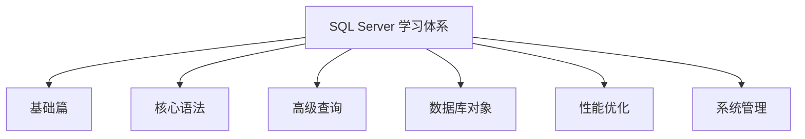

# 2025-SQL-Server-Study 自学资料库  

  
[](https://github.com/yourusername/2025-SQL-Server-Study)  
[](https://github.com/yourusername/2025-SQL-Server-Study/commits/main)

本项目是个人学习 Microsoft SQL Server 的完整学习资料库，包含系统化的学习笔记、实用代码示例和核心概念整理，适用于从入门到进阶的学习路径。



## 📚 内容体系

### 🧱 基础篇
- **安装配置**：详细安装指南与环境配置
- **SSMS工具**：图形界面高效使用技巧
- **数据库设计**：表结构设计与规范化
- **数据类型**：各类数据类型的应用场景

### ⚙️ T-SQL核心语法
```sql
-- 事务管理示例
BEGIN TRY
    BEGIN TRANSACTION
        UPDATE Accounts SET Balance = Balance - 100 WHERE AccountID = 123
        UPDATE Accounts SET Balance = Balance + 100 WHERE AccountID = 456
    COMMIT TRANSACTION
END TRY
BEGIN CATCH
    ROLLBACK TRANSACTION
    PRINT '交易失败: ' + ERROR_MESSAGE()
END CATCH
```
- **数据操作**：增删改查(CRUD)全解
- **函数应用**：内置函数与自定义函数
- **事务管理**：ACID特性与实战应用

### 🔍 高级查询技术
- **多表关联**：INNER/LEFT/RIGHT/FULL JOIN
- **子查询**：嵌套查询与相关子查询
- **CTE应用**：公用表表达式实战
- **窗口函数**：RANK(), ROW_NUMBER(), LEAD/LAG

### 🏗️ 数据库对象
| 对象类型 | 核心功能 | 应用场景 |
|---------|----------|----------|
| 存储过程 | 预编译SQL集合 | 复杂业务逻辑封装 |
| 函数 | 可重用计算单元 | 数据转换与计算 |
| 触发器 | 自动响应数据变更 | 审计日志、数据校验 |
| 视图 | 虚拟表封装 | 数据权限控制、简化查询 |
| 索引 | 加速数据检索 | 查询性能优化 |

### ⚡ 性能优化
- **执行计划分析**：解读查询优化器决策
- **索引策略**：聚集/非聚集索引设计原则
- **统计信息管理**：直方图与基数估计
- **查询重写技巧**：避免性能陷阱

### 🛡️ 系统管理
- **备份恢复**：完整/差异/事务日志备份
- **安全性配置**：权限管理与角色控制
- **高可用方案**：AlwaysOn、故障转移集群
- **日常维护**：索引重建、统计更新

## 🗂️ 项目结构
```
2025-SQL-Server-Study/
├── 基础篇/
│   ├── 安装配置指南.md
│   ├── SSMS高效技巧.md
│   └── 数据库设计原则.pdf
├── 核心语法/
│   ├── CRUD操作示例.sql
│   ├── 事务管理案例.md
│   └── 函数应用实战/
├── 高级查询/
│   ├ JOIN关联详解.md
│   ├ 子查询进阶技巧.md
│   └ 窗口函数应用案例.sql
├── 数据库对象/
│   ├ 存储过程开发指南.md
│   ├ 索引设计策略.pdf
│   └ 触发器实战案例/
├── 性能优化/
│   ├ 执行计划分析.md
│   ├ 查询优化技巧.sql
│   └ 统计信息管理指南.md
├── 系统管理/
│   ├ 备份恢复策略.md
│   ├ 安全配置最佳实践.pdf
│   └ 高可用方案对比.md
└── 实战案例/
    ├ 电商数据库设计案例/
    └ 金融交易系统优化/
```

## 🚀 学习路径


1. **入门阶段**：从`基础篇/安装配置指南.md`开始
2. **语法掌握**：精读`核心语法/`目录中的示例
3. **查询进阶**：练习`高级查询/`中的复杂案例
4. **对象设计**：研究`数据库对象/`中的设计模式
5. **性能调优**：分析`性能优化/`中的优化策略
6. **综合实战**：完成`实战案例/`中的完整项目

## 🌟 特色内容
- **执行计划图解**：可视化查询优化过程
- **索引设计实验室**：不同场景下的索引对比测试
- **事务隔离级别**：并发问题重现与解决方案
- **窗口函数速查表**：常用场景语法参考
- **高可用方案对比**：AlwaysOn vs 故障转移集群

## 🤝 贡献与反馈
> 本仓库主要用于个人学习记录，欢迎共同完善！

- 如有建议或问题，欢迎通过 **Issues** 提出
- 发现代码错误或笔记疏漏，可提交 **Pull Request** 帮助完善
- 期待你的贡献与反馈，共同提升学习资源质量！

---

**最后更新**：2025年07月05日  


**让我们一起攻克 SQL Server 技术栈！** 🚀
